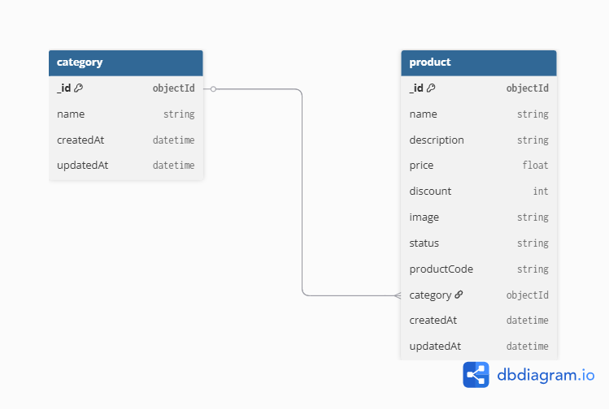

# 🛒 Product Maintenance  Backend 

A Node.js + MongoDB backend project to manage products with auto-generated product codes and category associations.

---

## 🔧 Technologies Used

- Node.js
- Express.js
- MongoDB (Mongoose)
- Postman for API Testing

---

## 📁 Features

- Create Category
- Create Product with auto-generated Product Code
- Update product status, discount, and description
- Filter products by category and search by name
- Product code generation logic implemented

---

## 📌 Product Code Format

`<hashed-name>-<start_index><substring><end_index>`

Example: `a1b2c3d4-0alport8`

---

## 📦 API Endpoints

### ➕ Create Category  
`POST /api/categories`

Request body example:

```json
{ "name": "Product categories" }
````

---

### ➕ Create Product

`POST /api/products`

Request body example:

```json
{
  "name": "xyz ",
  "description": "Test product",
  "price": 100,
  "discount": 10,
  "image": "http://example.com/image.jpg",
  "status": "In Stock",
  "category": "CATEGORY_ID_HERE"
}
```

---

### 🔄 Update Product

`PUT /api/products/:id`

Request body example:

```json
{ "status": "Stock Out", "discount": 15, "description": "New desc" }
```

---

### 🔍 Get Products with Filter

`GET /api/products?category=ID&search=alpha`

---

## ▶️ Run Instructions

1. Clone the repo
2. Run:

```bash
npm install
npm run dev
```

3. Setup your `.env` file with:

```
PORT=8000
MONGO_URI=your-mongo-uri
```

---
## 🧩 ER Diagram

The following diagram shows the relationship between Category and Product collections:




## 📜 License

This project is licensed under the MIT License - see the [LICENSE](LICENSE) file for details.

---

## 🧑‍💻 Author

Fariha Afrin Tamanna
